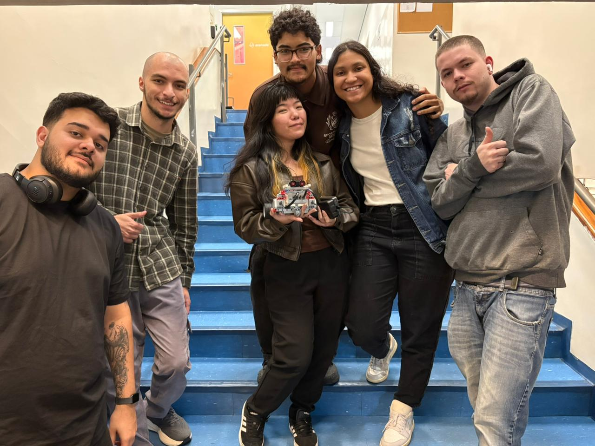

# Robô Móvel Inteligente **Binho**

Projeto desenvolvido durante a disciplina de **Robôs Móveis e
Inteligentes -- Faculdade Impacta**.\
Inclui códigos, simulações e anotações relacionadas à navegação,
sensores e controle de robôs autônomos.

------------------------------------------------------------------------

## 👥 Equipe de Desenvolvimento

  Integrante                 RA
  -------------------------- ----------
  Antony Reis                2301700
  Giovanna Santos            2301206
  Cinthya Mayumi Kuniyoshi   2301625
  Isaac Asenjo               2301311
  Enrico Marçola             2300368
  Kelvin                     2301504

### 📸 Foto da Equipe

------------------------------------------------------------------------

## 🤖 Visão Geral do Projeto

O projeto **Binho** é um robô móvel inteligente desenvolvido através de
etapas progressivas, onde cada fase introduziu melhorias e novos
desafios. A evolução foi orientada por experimentação prática e
adaptação de soluções mecânicas e lógicas.

------------------------------------------------------------------------

## 📍 Estágio 1: Prototipagem Inicial --- Movimento por Pulos

**Objetivo:** Validar a viabilidade de locomoção dinâmica baseada em
saltos.

**Características:** - Estrutura inicial com LEGO Mindstorms - Testes de
mobilidade por propulsão - Controle usando EV3 como unidade principal

**Resultado:**\
Um protótipo funcional capaz de se deslocar por pequenos saltos,
validando sensores e controle mecânico.

------------------------------------------------------------------------

## 🦾 Estágio 2: Adaptação para Escrita com Garra

**Objetivo:** Adicionar capacidade manipulativa para realizar escrita.

**Características:** - Integração de garra robótica - Controle refinado
de força e precisão - Sistema estacionário para traçar linhas e formas

**Resultado:**\
Robô apto a manipular utensílios com precisão suficiente para escrita
controlada.

------------------------------------------------------------------------

## ✏️ Estágio 3: Refinamento Final --- Locomoção com Rodas + Escrita com Caneta

**Objetivo:** Combinar mobilidade suave com escrita autônoma.

**Características:** - Substituição do sistema de pulos por rodas -
Suporte para caneta com controle de pressão - Traços mais estáveis e
coordenados

**Resultado:**\
Robô móvel capaz de se deslocar e escrever em diferentes superfícies.

------------------------------------------------------------------------

## 🏗️ Arquitetura Geral

    ┌─────────────────────────────────────┐
    │   EV3 Mindstorms (Processamento)    │
    ├─────────────────────────────────────┤
    │  Sistema Locomotor                  │
    │  • Estágio 1: Mov. por Pulos        │
    │  • Estágio 3: Mov. por Rodas        │
    ├─────────────────────────────────────┤
    │  Efetor Final                       │
    │  • Estágio 2: Garra Robótica        │
    │  • Estágio 3: Suporte de Caneta     │
    └─────────────────────────────────────┘

------------------------------------------------------------------------

## 🖼️ Foto do Protótipo (Adicionar Aqui)

> *(Exemplo de referência: `docs/imagens/prototipo.jpg`)*

------------------------------------------------------------------------

## 🚀 Próximos Passos

-   [ ] Implementar interface para desenho personalizado
-   [ ] Otimizar escrita através de aprendizado de máquina
-   [ ] Adicionar reconhecimento visual para escrita guiada
-   [ ] Testar versões com novos tipos de caneta e superfícies

------------------------------------------------------------------------

## 📝 Notas Finais

-   Cada estágio foi registrado e documentado para referência
-   A evolução priorizou testes práticos e melhorias iterativas
-   O repositório inclui logs de calibração e versões do código
